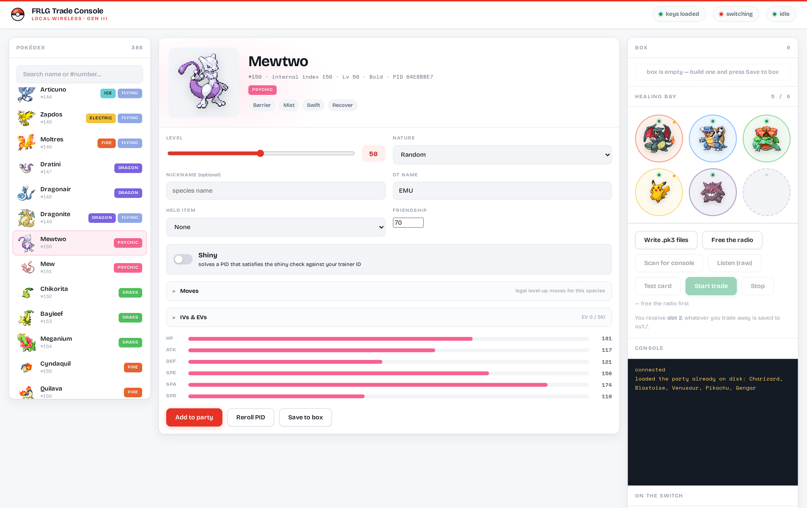
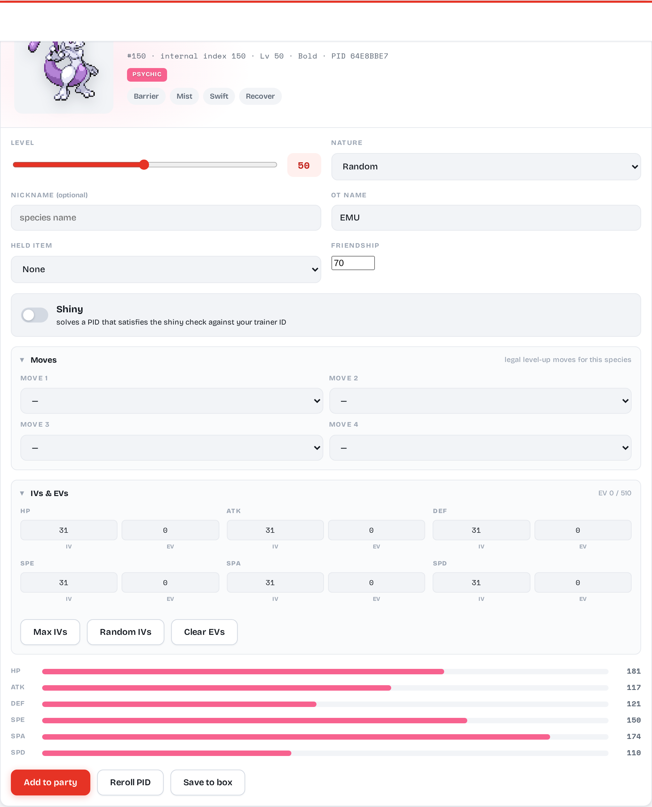
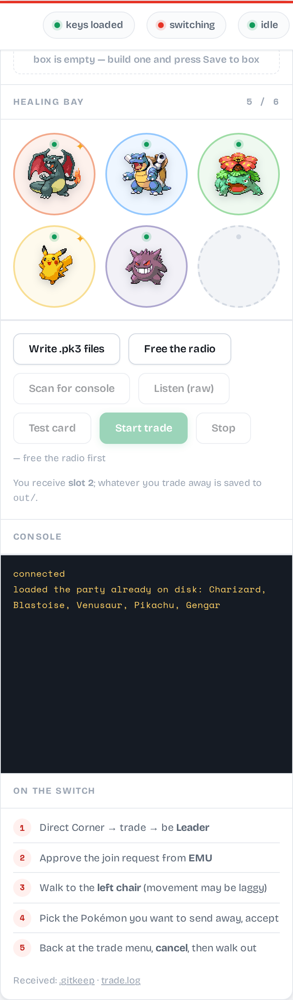
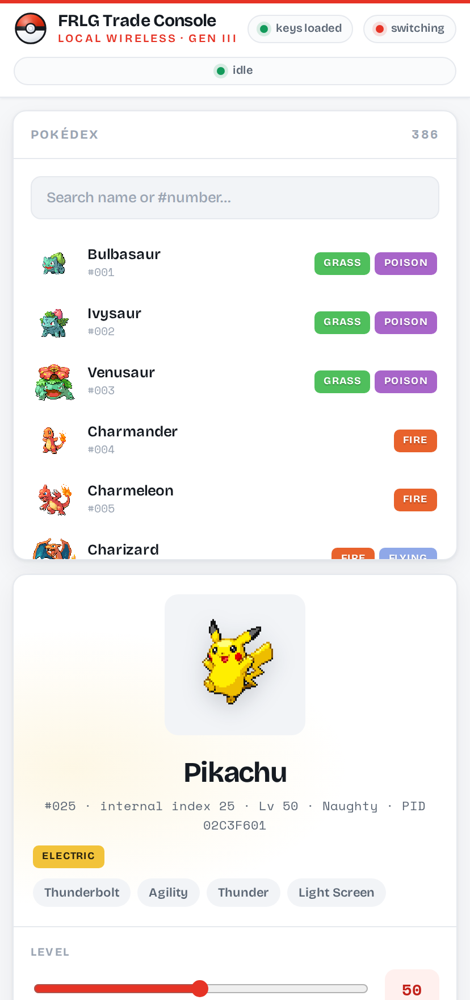

<div align="center">


# FRLG Trade Console

**Build any Gen III Pokémon in a browser and trade it to a real Nintendo Switch
over local wireless.**

No mods. No custom firmware. No save editing. The console does an ordinary
in-game trade — this just sits on the other end of it.

[](LICENSE)
[](LICENSING.md)
[](#requirements)
[](docker-compose.yml)



</div>

---

## What this is

[`tornadus/frlg-ldn-trade`](https://github.com/tornadus/frlg-ldn-trade) proved a
PC can join a Switch's local-wireless session and trade in FireRed/LeafGreen.
It is a command-line proof of concept: you hand-craft `.pk3` files, wrestle your
Wi-Fi card away from NetworkManager, and read stack traces when it doesn't work.

This is the part that was missing — a dashboard that makes it usable:

- **Pick from all 386 Gen III species** with real in-game sprites
- **Set level, nature, shininess, held item, moves, IVs and EVs** — all validated
- **Manage a party of six** and keep a box of saved builds
- **Drive the radio** from the browser, safely, without losing your own network
- **Diagnose it when it fails**, which it will — the hard part of this project is
  never the Pokémon, it's the radio

## Screenshots

<table>
<tr>
<td width="50%"><br>
<b>Builder</b> — legal level-up moves, IVs and EVs with the 510 cap enforced, held items, live stats</td>
<td width="50%"><br>
<b>Healing bay</b> — six sockets, type-coloured rings, and a live console</td>
</tr>
<tr>
<td><br>
<b>Responsive</b> — usable from a phone while you stand at the Switch</td>
<td>

**Details it gets right**

- Shininess is solved for, not flagged — a PID satisfying
  `(TID ^ SID ^ PIDhi ^ PIDlo) < 8` *and* your chosen nature
- Species are written as the game's **internal index**, which diverges from
  National Dex above #251 (Treecko is 277, not 252)
- EVs are capped at 255/stat and 510 total, trimmed from the largest down
- Moves offered are only what that species legally learns by level-up in FRLG

</td>
</tr>
</table>

## Requirements

| | |
|---|---|
| **OS** | Linux. LDN needs raw nl80211 access; there is no macOS or Windows path. |
| **Wi-Fi** | A card that can transmit action frames in monitor mode. **Test yours** with the built-in card test before buying anything. |
| **A second network path** | Ethernet, or anything that isn't the Wi-Fi card. The radio gets taken over; without a fallback you'd cut your own connection. |
| **Switch** | FireRed or LeafGreen via the GBA Nintendo Switch Online app, played to the Direct Corner. |
| **`prod.keys`** | Dumped from a console you own with [Lockpick_RCM](https://github.com/shchmue/Lockpick_RCM). Not downloadable — see [keys/README.md](keys/README.md). |
| **Docker** | Or Python 3.12+ if you'd rather run it directly. |

## Install

```bash
git clone https://github.com/ImaEternal/FRLG-Trade-Console
cd FRLG-Trade-Console
bash scripts/setup.sh          # fetches upstream, applies patches, gets sprites + data
$EDITOR .env                   # set your interfaces
cp /path/to/prod.keys keys/    # from your own console
docker compose up -d dashboard
```

Then open **http://localhost:8781**.

`setup.sh` deliberately fetches three things rather than shipping them: upstream's
AGPL engine, Nintendo's sprite artwork, and the PokeAPI-derived game data. See
[LICENSING.md](LICENSING.md) for why.

## Using it

1. On the Switch: **Direct Corner → trade → Leader**, and *stay on the waiting screen*
2. **Free the radio** — moves this machine onto its wired link first, and refuses if that link isn't actually carrying traffic
3. **Scan for console** — confirms your session is visible before you commit
4. **Start trade** → approve the join from `EMU` on the Switch
5. Walk to the **left chair**, pick what you're sending, accept
6. **Restore networking** when you're done

You receive whatever is in **slot 2**. What you traded away is saved to `out/`.

## When it doesn't work

Most of the difficulty is the radio, and the failure modes are indistinguishable
without tooling. Three buttons separate them:

| button | answers |
|---|---|
| **Test card** | *Can this card do LDN at all?* Actually transmits action frames — something `iw list` cannot tell you. |
| **Listen (raw)** | *Is the console emitting?* Raw per-channel capture with **no keys, no LDN decode**. Frames but no action frames ⇒ the console isn't advertising. Action frames ⇒ the radio is fine and the fault is higher up. |
| **Scan for console** | *Is it MY game?* Prints each network's `local_communication_id` and says whether it's FRLG or another title. |

### `no joinable FRLG network (saw 0)`

The single most common failure, and it has four distinct causes we hit and fixed:

- **The scan window is 330ms.** Upstream dwells 0.11s across three channels.
  A console is easily missed in that blink. Widened and made tunable.
- **5GHz is never scanned.** The library supports `36/40/44/48`; upstream only
  scans `1/6/11`. A console on a 5GHz AP can host there.
- **The comm-id varies by region.** Upstream hardcodes `0x0100610011000000`;
  this console advertises `0x01006fa0233f8000`. Use `Scan for console` to read
  yours, then set `FRLG_COMM_ID` in `.env`.
- **It joins the wrong console.** Upstream falls back to "the only joinable
  network", which with a neighbour's Switch in range means repeatedly
  associating to a stranger's game. Now opt-in via `FRLG_ANY_NETWORK=1`.

All four are in [`patches/`](patches/README.md).

## Configuration

Everything machine-specific lives in `.env` — see [`.env.example`](.env.example).
Nothing is hardcoded, and no secret is ever read from it.

## Autostart

```bash
sed "s|@INSTALL_DIR@|$PWD|g" systemd/frlg-dashboard.service \
  | sudo tee /etc/systemd/system/frlg-dashboard.service
sudo systemctl enable --now frlg-dashboard.service
```

Same for `frlg-radio.path` and `frlg-radio.service`, which let the dashboard
request a radio switch without the container needing host privileges.

## Architecture

```
browser ──HTTP/SSE──► Flask (container, host network, privileged)
                        │
                        ├── pk3build.py   builds .pk3 (crypto, PID solving, stats)
                        ├── scan.py       LDN discovery
                        ├── diag.py       raw capture + injection test
                        └── frlgtrade.py  upstream engine ──► nl80211 ──► Wi-Fi ──► Switch

control/request ──watched by──► systemd ──► scripts/radio.sh   (on the HOST)
```

The container is privileged and shares the host network namespace, because
`ldn` drives the card over netlink. It deliberately does **not** get host PID
or mount namespaces: changing host networking from inside a container is a
container escape in all but name, so radio switching goes through a request
file that a systemd path unit picks up.

## Credits

Built on [tornadus/frlg-ldn-trade](https://github.com/tornadus/frlg-ldn-trade)
(AGPL-3.0) and [kinnay/LDN](https://github.com/kinnay/LDN) (GPL-3.0). The
diagnostics were informed by
[SantiagoPuertas/pokemon-ldn-trade](https://github.com/SantiagoPuertas/pokemon-ldn-trade),
which independently arrived at the same "is it the PC or the Switch?" problem.
Gen III data structures cross-checked against [pret/pokefirered](https://github.com/pret/pokefirered).

See [NOTICE](NOTICE) for full attribution.

## Licence

Our code is **[EUPL-1.2](LICENSE)** — attribute the original, and publish your
modifications. Upstream's engine stays AGPL-3.0 and is fetched, not vendored;
our patches to it are AGPL-3.0 too. [LICENSING.md](LICENSING.md) explains the
split.

Pokémon is a trademark of Nintendo, Creatures Inc. and GAME FREAK Inc. This
project is unaffiliated with and unendorsed by any of them. Use it with games
and hardware you own.
